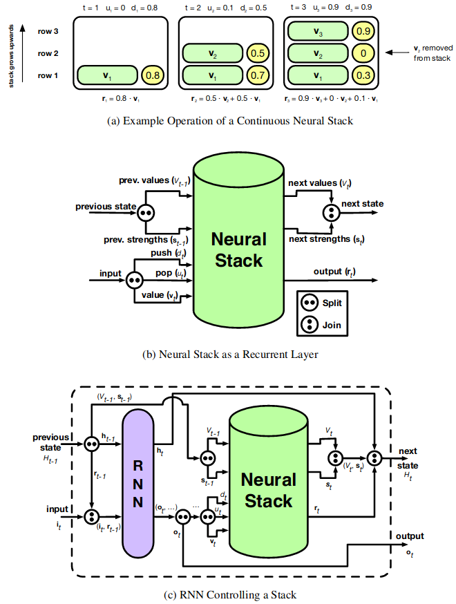
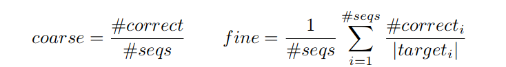
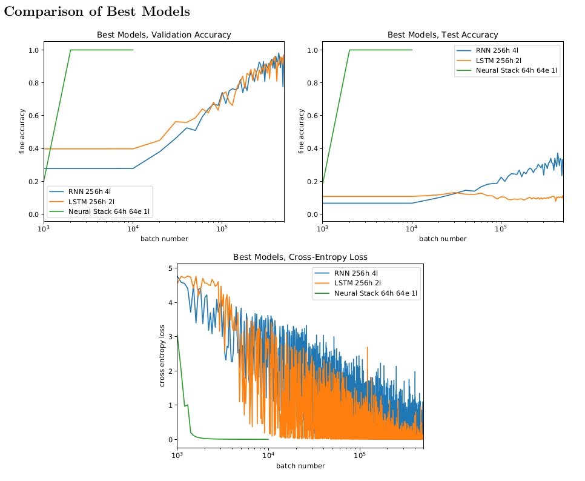
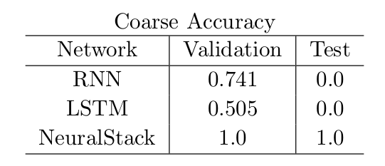
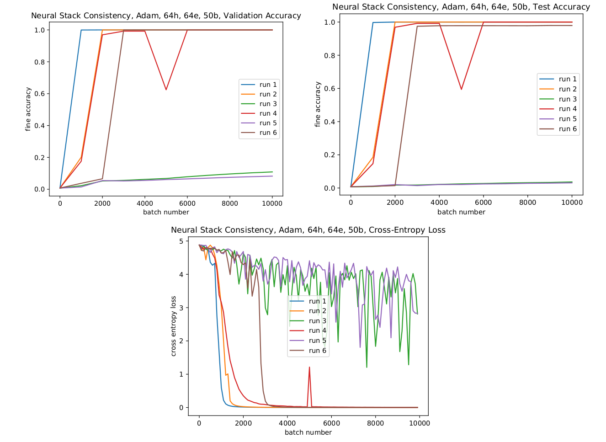

# neural-stack
Implementing DeepMind's Differentiable Neural Stack from scratch using PyTorch

Based on "Learning to Transduce with Unbounded Memory" by Edward Grefenstette, Karl Moritz Hermann, Mustafa Suleyman, Phil Blunsom. ([arXiv](https://arxiv.org/abs/1506.02516))

I implemented and trained a differentiable neural stack for an assignment in CS281: Advanced Machine Learning at Harvard in 2019, and was the only student in the class to successfully make it work.

## Description

A multi-layer vanilla RNN, LSTM, and LSTM with a neural stack are trained to reverse an input sequence of characters. However, strings in the training data have lengths between 8 and 64 characters, while the test set has strings of lengths 65 to 128. This crucial distinction between the training and test sets will gauge the generalizability of the network, and will show if the networks actually *learned* the concept of reversing a sequence.

As an example of the input and target data, suppose '$' is the start character, '|' is the separator, and '&' is the termination character. The input could be:

`$A string to reverse|`

and the expected output would be:

`esrever ot gnirts A&`

During training, strings within the length constraint were generated randomly, spanning a space of 10135 possible training sequences, so in practice "infinite" data was available and overfitting is impossible with the network sizes tested.

I tested standard recurrent neural networks (Elman RNN and LSTM) as a baseline for this task, and an LSTM connected to DeepMind's differentiable neural stack. The differentiable stack architecture can be used as a standard stack data structure, but it has inputs that can be controlled by a neural network. All the operations in the stack are differentiable, allowing for standard backpropagation techniques to train the neural network to use the stack in a way it finds useful, storing any type of encoded information in the data structure. 

(From [Learning to Transduce with Unbounded Memory](https://arxiv.org/abs/1506.02516))

While using such an architecture to reverse strings is an academic example, as noted in the original paper the ability to reverse information, or to store it away for later use, is a very powerful addition to neural networks. Without needing to specify how these data structures are to be used in a given task, a network can learn to make use of them. For example, when translating between languages, there are often reorderings of parts-of-speech where a stack could be helpful. While standard RNN approaches have been shown to work for these tasks, they fail to consistently generalize to strings longer than those seen in training. The logically unbounded memory offered by a neural stack solves the issue with long-range reorderings.

## Results

The performances of the RNN, LSTM, and LSTM + Neural Stack models were tested on fixed validation data (using strings of the same length as in training) and test data (using strings strictly longer than those used in training, guaranteeing that they were not seen).

The performance was evaluated using "coarse" and "fine" accuracy scores with

where #correct and #seqs are the number of correctly predicted sequences (in their entirety) and the total number of sequences in the validation/test sets, respectively. In the fine metric, #correcti is the number of correctly predicted characters before the first error in the *i*th sequence of the validation/test set, and |targeti| is the length of the test segment in that sequence. Essentially, the coarse accuracy is an "all or nothing" measure, not giving any partial credit, while the fine accuracy gives partial credit for reversals that are correct up to a point.

### Best Models

The fine accuracy results for the best RNN, LSTM, and LSTM + Neural Stack models are shown below. I performed hyperparameter searches across the size of the hidden state, learning rate, optimizer, number of stacked RNN/LSTM layers, and embedding size to arrive at these top-performing models. 

Notice that the Neural Stack achieves perfect reversals even on the test set, while the RNN and LSTM models have significantly worse accuracy on these longer strings.

On coarse accuracy, we see that the RNN and LSTM networks could not successfully reverse a single string from the test set in its entirety!

### Neural Stack Training Consistency

Typically, the networks with neural stacks would eventually figure out how to properly use the stacks, but occasionally the networks settled towards the wrong regions of parameter-space where the stacks were not used effectively, as shown by the consistency plots below:

In these identical runs (with different starting configurations of the randomized weights), 2 of 6 runs did not use the stack correctly. That said, the success rate of 4/6 is quite good, since in those cases we see that the network achieves perfect accuracy.

## Additional Notes

For additional details about the runs performed, the setup of the test, and the model architectures, please refer to the [report](neuralstack.pdf) I wrote in the class.
